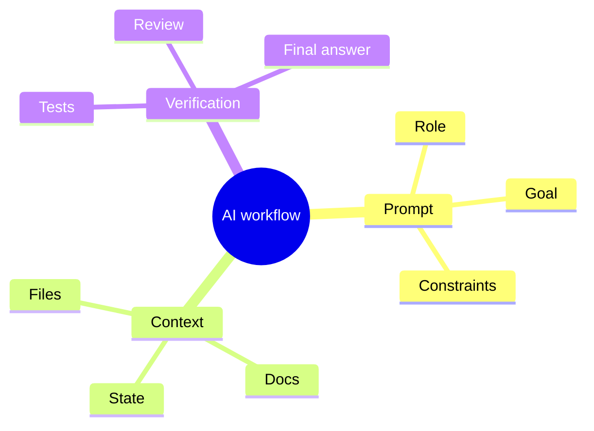

# AI 工作流：从提示词到交付

## 核心原则

- 给模型清晰的角色、目标和输出格式
- 把不稳定信息放进显式上下文
- 让验证步骤和生成步骤分离

## 输出格式示例

```json
{
  "goal": "summarize code changes",
  "constraints": [
    "keep it concise",
    "cite modified files",
    "state verification status"
  ]
}
```

## 质量检查

| 检查项 | 说明 |
| --- | --- |
| 来源是否明确 | 输入上下文是否可追溯 |
| 结构是否稳定 | 输出字段是否固定 |
| 结果是否可验证 | 是否有测试、日志或页面回看 |

## 代理流程图



---

## 结论

> 好的 AI 页面不是“能生成内容”，而是“能稳定交付结果”。
