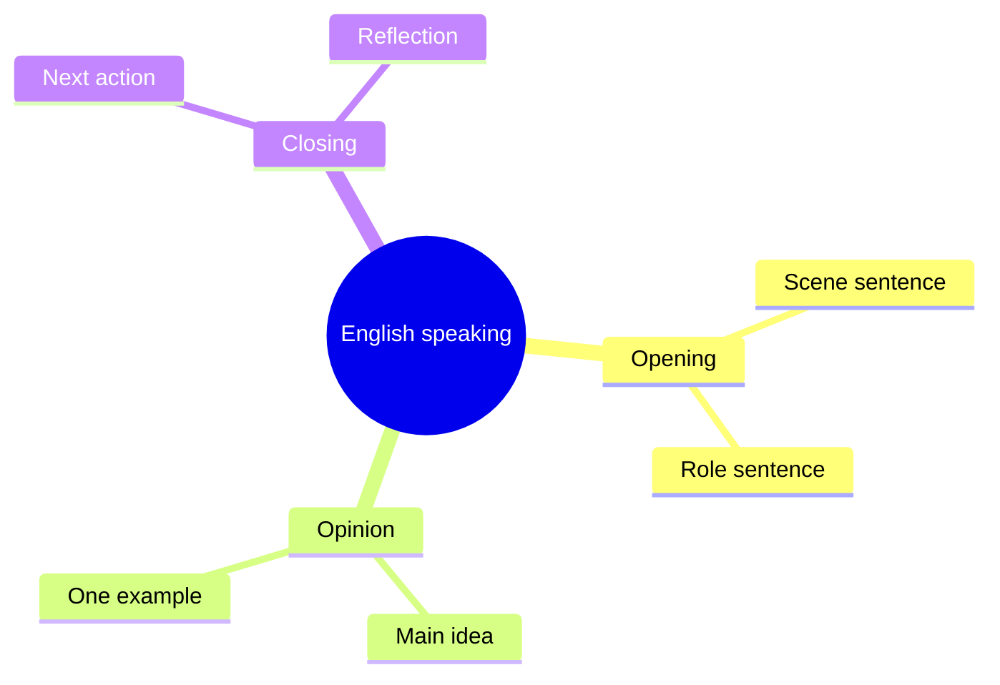

# 英语表达：故事化开口

> 目标：把“我知道单词，但说不出来”拆成可练习的步骤。

## 学习路径

- 用 **场景句** 打开话题
- 用 **原因句** 补充观点
- 用 **结果句** 做收尾
- 用 `3-sentence loop` 反复训练

## 表达模板

| 场景 | 起手句 | 延展句 |
| --- | --- | --- |
| 自我介绍 | I usually work on... | The part I enjoy most is... |
| 复盘经历 | One thing I learned is... | Next time I would... |
| 观点表达 | I tend to think... | The main reason is... |

## 练习代码块

```text
Topic: Describe a skill you are learning.
1. Start with the situation.
2. Explain why it matters.
3. End with one next action.
```

---

## 思维导图



## 今日任务

- [x] 跟读 3 轮模板句
- [ ] 用自己的项目经历替换关键词
- [ ] 录一段 30 秒复述音频
