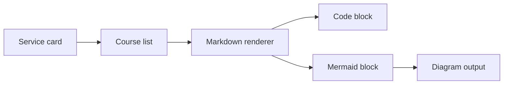

# 编程实战：把需求拆成系统

## 四段式拆解

1. 先定义用户界面和关键路径
2. 再定义状态与数据结构
3. 再定义接口与错误处理
4. 最后补构建、测试和回归验证

> 你写的不是“页面”，而是一套可维护的行为系统。

## 最小实现清单

- 页面入口
- 路由状态
- 课程数据模型
- Markdown 渲染器
- 图表渲染兜底

## 示例代码

```javascript
function openLearningCourse(courseId) {
  const selected = courses.find((course) => course.id === courseId);
  if (!selected) {
    throw new Error('course not found');
  }
  return {
    ...selected,
    openedAt: new Date().toISOString(),
  };
}
```

## 设计表

| 模块 | 输入 | 输出 |
| --- | --- | --- |
| 服务卡片 | 服务状态 | 导航入口 |
| 课程列表 | 分类筛选 | 当前课程 |
| Markdown 渲染器 | 原始正文 | 安全 HTML / Widget |
| Mermaid 渲染器 | `mermaid` 代码块 | SVG / 源码兜底 |

## 系统图


